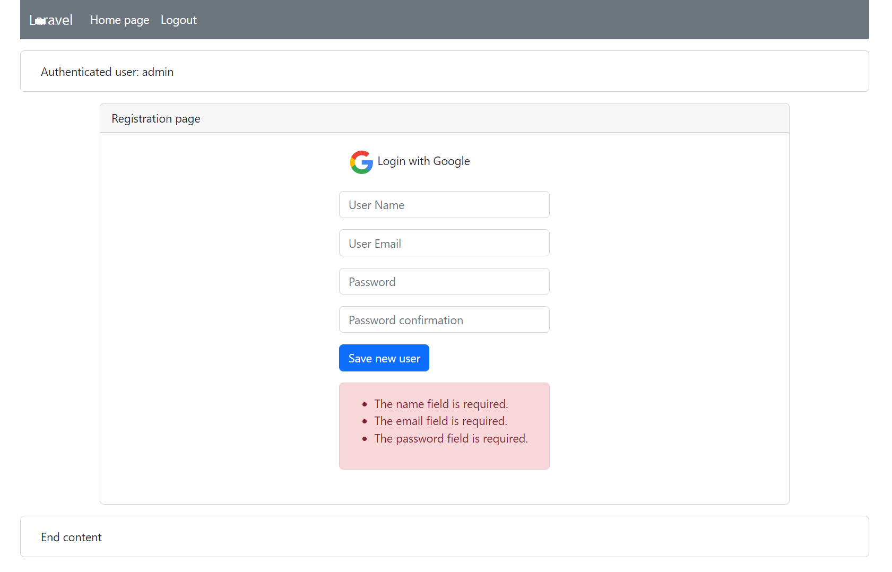

<p align="center"><a href="https://laravel.com" target="_blank"></a></p>

# Laravel OpenWeatherMap API

The application built without Laravel Sail.

### Commands as superuser to initialize the application

The system must first have the necessary components installed,
such as composer, git, docker. PHP version >8.1.
Sail has been removed completely from composer applications and dependencies.

```
> cd /path_to_projects
> git clone https://github.com/Igor-ad/laravel_openweathermap_api.git
> cd /path_to_projects/laravel_openweathermap_api
> cp ./.env.example ./.env
```

It is necessary to fill in the parameters of the environment file ./.env with the following values:
DB_PASSWORD, GOOGLE_CLIENT_ID, GOOGLE_CLIENT_SECRET, GOOGLE_CLIENT_URL, OPENWEATHER_API_KEY,
OPENWEATHER_CACHE_TIME

Update libraries and modules. Create and run a containers.

```
> composer update
> chmod 777 -R ./storage/logs
> docker-compose build 
> docker-compose up 
```

The Laravel home page must be accessible from a local address
http://localhost/.
If the directories that Laravel should write to are not writable on behalf of the owner, 
connecting to the home page may cause a number of access errors.
The following commands will open "public" entry access to the appropriate directories.
```
> chmod 755 -R ./public
> chmod 755 ./.env
> chmod 777 -R ./storage/framework/sessions
> chmod 777 ./storage/framework/views
> chmod 777 ./storage/framework/cache/data
```

Generate the application key and run the migration commands.

```
> php artisan key:generate
> php artisan migrate
```

If the migration command returns a database connection error,
then you should replace in the environment file ./.env
the value of the DB_HOST parameter to the IP address of the MySQL container.
(Database connection error may appear during the testing phase)
The IP address of the MySQL container can be obtained by running the command:
```
> docker inspect `docker ps|grep mysql|cut -d' ' -f1`|grep '"IPAddress": "1'|cut -d'"' -f4
```

and repeat the migration command

```
> php artisan migrate
```

If testing is carried out on another machine on the local network,
connection to the Redis container may fail.
In this case, you should replace ./.env in the environment file
the value of the REDIS_HOST parameter to the IP address of the redis container.
The IP address of the redis container can be obtained by running the command:

```
> docker inspect `docker ps|grep redis|cut -d' ' -f1`|grep '"IPAddress": "1'|cut -d'"' -f4
```

To test the application on the local network, the Google DNS IP address is used.

##### Examples of web pages





##### Example API JSON response

```
{
    "user": {
        "id": 1,
        "first_name": null,
        "last_name": null,
        "email": "admin@mail.com",
        "profile": null,
        "status": "Active",
        "created_at": "2023-11-18T15:28:38.000000Z",
        "updated_at": "2023-11-18T15:28:38.000000Z"
    },
    "main": {
        "temp": 5.61,
        "pressure": 1018,
        "humidity": 88,
        "temp_min": 3.6,
        "temp_max": 7.9
    }
}
```

Used hashed token authentication in Sanctum.

When making requests using API tokens, 
the token should be included in the Authorization header as a Bearer token.
