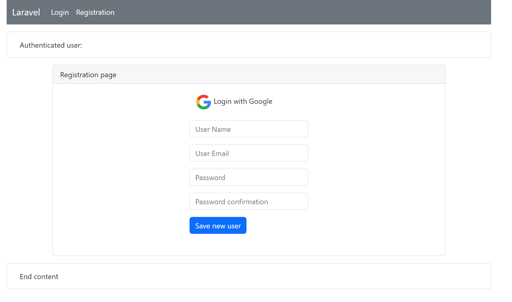

<p align="center"><a href="https://laravel.com" target="_blank"></a></p>

# Laravel OpenWeatherMap API

The application built without Laravel Sail.

### Команды от имени супер пользователя для инициализации приложения

В системе предварительно должны быть установлены необходимые компоненты,
такие как composer, git, docker. Версия PHP >8.1.
Sail удален полностью из приложения и зависимостей composer.

```
> cd /path_to_projects
> git clone https://github.com/Igor-ad/laravel_openweathermap_api.git
> cd /path_to_projects/laravel_openweathermap_api
> cp ./.env.example ./.env
```
Необходимо заполнить параметры файла окружения ./.env соответствующими значениями:
DB_PASSWORD, GOOGLE_CLIENT_ID, GOOGLE_CLIENT_SECRET, GOOGLE_CLIENT_URL, OPENWEATHER_API_KEY,
OPENWEATHER_CACHE_TIME

Создать контейнера и запустить их. Обновить библиотеки и модули.

```
> composer update
> chmod 777 -R ./storage/logs
> docker-compose build 
> docker-compose up 
```

После запуска домашня страница Laravel должна быть доступна по локальному адресу
http://localhost/ .
Если каталоги, в которые Laravel должен производить запись, 
не доступны для записи от имени владельца,
то подключение к домашней странице может вызвать ряд ошибок доступа.
Следующие команды открывают доступ на запись "для всех" в соответствующие каталоги.

```
> chmod 755 -R ./public
> chmod 755 ./.env
> chmod 777 -R ./storage/framework/sessions
> chmod 777 ./storage/framework/views
> chmod 777 ./storage/framework/cache/data
```

Выполняем команды миграции, генерации ключа приложения и подготовку библиотек.

```
> php artisan key:generate
> php artisan migrate
```

Если команда миграции возвращает ошибку соединения с базой данных, 
то следует заменить в файле окружения ./.env 
значение параметра DB_HOST на IP адрес контейнера mysql.
(Ошибка соединения с базой скорее может проявиться на этапе тестирования.)
IP адрес mysql контейнера можно получить выполнив команду:

```
> docker inspect `docker ps|grep mysql|cut -d' ' -f1`|grep '"IPAddress": "1'|cut -d'"' -f4
```

и повторить команду миграции

```
> php artisan migrate
```

Если тестирование проводить на иной машине в локальной сети, 
соединение с контейнером Redis может не произойти.
В таком случае следует заменить в файле окружения ./.env
значение параметра REDIS_HOST на IP адрес контейнера redis.
IP адрес redis контейнера можно получить выполнив команду:

```
> docker inspect `docker ps|grep redis|cut -d' ' -f1`|grep '"IPAddress": "1'|cut -d'"' -f4
```

Для тестирования приложения в локальной сети истользуется IP адрес DNS Google.
Чтобы использовать реальную геолокацию с реальным IP адресом 
следует раскоментировать 23 строчку в файле
App\Http\Controllers\AbstractWeatherController

##### Examples of web pages





